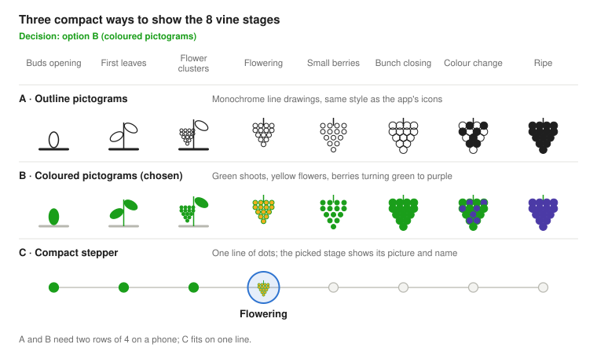

# Design doc — Issue #66 & phenology-based disease sensitivity

## Glossary

| Term | Meaning |
| --- | --- |
| LAI (Leaf Area Index) | Leaf surface (one side) per unit of ground surface, in m²/m². LAI = 4 means 4 m² of leaves above each m² of soil. The app uses it to turn a copper dose in g/ha into a deposit in mg/m² of leaf. |
| Phenological stage | A visible step in the vine's yearly cycle (bud break, flowering, veraison…). |
| BBCH scale | Standard two-digit code for phenological stages (00 = dormant bud, 65 = full flowering, 81 = start of ripening, 89 = ripe). |
| Fruit set (nouaison, allegagione) | Flowers turn into small berries after flowering. |
| Bunch closure | Berries grow until they touch each other and the bunch closes. |
| Veraison (véraison, invaiatura) | Berries soften and change colour; ripening starts. |
| Ontogenic resistance | Resistance that a tissue gains with age, e.g. berries become hard to infect a few weeks after bloom. |
| Rachis / pedicel | The bunch's main stem / the small stalk of each berry. |
| Primary infection | The first infections of the season, from spores that overwintered in the soil or on the wood. |
| 3×10 rule | Rule of thumb for the first downy mildew infections: shoots ≥ 10 cm, ≥ 10 mm rain, about 10 °C. |
| Wash-off | Share of the fungicide deposit removed by rain. |

## Context

Let growers record each parcel's phenological stage (e.g. "flowering") so the app knows when vines are most susceptible to disease. Source: [cpelican/agricolala#66](https://github.com/cpelican/agricolala/issues/66) — "The user should inform the system about the phenological stage" (open, no comments).

What the issue asks for:

- An entry point **inside the treatment modal**.
- A choice between **simple, visual stage summaries** of how the grapes look ("blossom", etc.), each mapped to a precise phenological stage.
- A stored record of **parcel · stage · date**.
- Goal: give the system better knowledge of the vine's sensitivity to diseases.

## Status

As of 4 Oct 2026. v1 is done: growers record the stage and it shows in the Excel export. v2 has started: the per-stage disease levels are stored (P6), but no screen or job reads them yet.

| Phase | PR | State |
| --- | --- | --- |
| v1 · PR 1 — model, helpers, actions | [cpelican/agricolala#69](https://github.com/cpelican/agricolala/pull/69) | Merged 28 Sep 2026 |
| v1 · PR 2 — stage picker in the modal and on the parcel pages | [cpelican/agricolala#70](https://github.com/cpelican/agricolala/pull/70) | Merged 4 Oct 2026 |
| v1 · PR 3 — "Phenological stage" column in the Excel export (P9) | [cpelican/agricolala#72](https://github.com/cpelican/agricolala/pull/72) | Merged 4 Oct 2026 |
| v2 · PR 1 — `DiseaseStageSensitivity` table seeded from the matrix (P6) | v2 PR 1 | In review |
| v2 · PR 2 – v4 | — | Not started |

## Current state

Since #69, #70 and #72 the app records each parcel's stage and exports it. v2 PR 1 stores each disease's level per stage, but nothing reads it yet: disease risk is still a fixed calendar window, and coverage still assumes a fully grown canopy all season.

| Area | Where | What it does today | Phenology gap |
| --- | --- | --- | --- |
| Disease windows | `Disease.sensitivityMonthMin/Max` in `prisma/schema.prisma`; seeded in `prisma/seed.ts` | Oidium = months 4–8, Peronospora = months 3–7, same for every parcel and year | An early or late season shifts real risk by 2–4 weeks; months cannot express "flowering". v2 PR 1 adds `DiseaseStageSensitivity` and `isDiseaseActive`; the month fields stay as fallback |
| Treatment suggestions | `app/api/cron/suggest-treatments/route.ts` + `getCurrentDiseases` | Re-proposes last products once `daysBetweenApplications` has elapsed, if the disease month window is active | Same cadence at bud break and at flowering, although risk differs a lot |
| Coverage widget | `lib/coverage-helpers.ts` | Residual dose after rain wash-off and time decay; copper converted to mg/m² with a fixed LAI = 4 (`COPPER_LEAF_AREA_FACTOR`) | Measured LAI in 4 California vineyards ran from 0.7–1.0 early in the season to 2.4–4.0 at full canopy around veraison ([Kang et al. 2022, Irrigation Science](https://pmc.ncbi.nlm.nih.gov/articles/PMC9509311/)); leaves grown after a spray carry no deposit |
| Protection pill / advice | `components/substances/coverage-headline.tsx` | "Re-treat now / soon / protected" from thresholds + 3-day rain forecast | Advice is the same whether the vine is at a low-risk or a critical stage |
| Treatment modal | `components/treatments/add-treatment-dialog-form.tsx`, `createTreatmentSchema` in `lib/actions-schemas.ts` | Date, parcels, products + doses, diseases, water dose | Done in #70: optional stage field (`treatment-stage-field.tsx`) |
| Treatment window | `lib/applicability.ts` | Hard-coded months 3–10 plus wind and rain checks | Could start at bud break instead of March |

## Proposed design for #66

Shipped in #69, #70 and #72; the subsections below describe what was built, with the changes made during review.

Add an optional, picture-based "How do your vines look?" step to the treatment modal that writes one `PhenologyObservation` (parcel · stage · date) per selected parcel.

### Goals and non-goals

- **Goal:** record the stage in under 5 seconds, without knowing the BBCH scale.
- **Goal:** keep stage history per parcel, so any feature can ask "what stage was parcel X at on date D?".
- **Goal:** store the precise BBCH code behind each simple choice, so later features can reason on it.
- **Non-goal (v1):** predicting the stage automatically from temperature (see Propositions, P5).
- **Non-goal (v1):** per-grape-variety sensitivity.

### Simple stages shown to the user

Eight choices, each an illustration + one plain label. The BBCH range is stored in code, not shown.

| Enum value | Label shown (en) | What the grower sees | BBCH |
| --- | --- | --- | --- |
| `BUD_BREAK` | Buds opening | Green tip visible through the wool | 05–09 |
| `LEAVES_UNFOLDING` | First leaves | 2–6 leaves spread out, shoots < 20 cm | 11–16 |
| `FLOWER_CLUSTERS` | Flower clusters visible | Clusters separated, flowers still closed | 53–57 |
| `FLOWERING` | Flowering | Caps (calyptras) falling, pollen visible | 60–69 |
| `FRUIT_SET` | Small berries | Berries set, up to pea size | 71–75 |
| `BUNCH_CLOSURE` | Bunch closing | Berries touch each other | 77–79 |
| `VERAISON` | Colour change | Berries soften and change colour | 81–85 |
| `RIPE` | Ripe / harvested | Ready for harvest or picked | 89–91 |

Dormancy (BBCH 00–03) is implied when no observation exists for the current season.

Picture options; all are kept small so the modal does not need much scrolling:



- **A · Outline pictograms**: monochrome line drawings (~40 px), same style as the app's icons; two rows of 4 on a phone.
- **B · Coloured pictograms**: green shoots, yellow flowers, berries turning green to purple (~40 px); two rows of 4 on a phone.
- **C · Compact stepper**: one line of 8 dots; only the picked stage shows its picture and name.

Decision: option B, coloured pictograms (drawn in-house as small SVG icons).

### Data model

A separate model rather than a column on `Treatment`: the stage belongs to the parcel at a date, a grower can observe it without treating, and one treatment can cover several parcels. It holds only parcel, stage and date (decided in review of #69): the owner comes from the parcel, and the stage at a treatment is the parcel's latest observation on or before the treatment date.

```prisma
enum PhenologicalStage {
  BUD_BREAK
  LEAVES_UNFOLDING
  FLOWER_CLUSTERS
  FLOWERING
  FRUIT_SET
  BUNCH_CLOSURE
  VERAISON
  RIPE
}

model PhenologyObservation {
  id         String            @id @default(cuid())
  parcelId   String
  stage      PhenologicalStage
  observedAt DateTime
  createdAt  DateTime          @default(now())
  updatedAt  DateTime          @updatedAt
  parcel     Parcel            @relation(fields: [parcelId], references: [id], onDelete: Cascade)

  @@index([parcelId, observedAt])
}
```

Migration generated with `npx prisma migrate dev` (no hand-written SQL). `lib/phenology.ts` holds the stage order, `PHENOLOGY_STAGE_BBCH` (enum → BBCH range), the 14-day hint and 21-day expiry rules, and `getStageAt` (stage of a parcel at a date). The pictograms live in `components/phenology/stage-icon.tsx`.

### UX in the treatment modal

1. New optional block after the date: "How do your vines look?" with 2 rows of 4 illustrated tiles. One stage per treatment, recorded for every selected parcel (decided).
2. Nothing is selected by default (changed in #70): the selected parcels' last stage, as of the treatment date, is only **suggested** with a dashed outline. If it is older than 14 days, the next stage is suggested instead; after 21 days the stage expires, the parcel shows "Stage unknown" and nothing is suggested. A stage is saved only when the grower taps it, so an untouched picker never re-records a stage and a backdated treatment does not get today's stage.
3. "Skip" is always possible; the treatment is saved without an observation.
4. If the chosen stage is earlier than the last recorded one, show a soft warning ("Earlier than what you recorded on 12 May — correct?"), never a blocker.
5. Parcel pages, for observations without a treatment (server action `recordPhenologyObservation` in `lib/actions-phenology.ts`):
    - List card: current stage or "Stage unknown", plus a dashed **Mark <next stage>** pill; when the stage is unknown or ripe, the pill opens the full **Update stage** picker.
    - Detail page: "Growth stage" with "Set N days ago" and the 8 stages as tiles.
    - Tapping a tile or the pill opens a confirmation dialog (picture, description, current stage); only **Confirm** records it. A newer observation also corrects a wrong one.

### Server changes

- `createTreatmentSchema`: optional `phenologicalStage`.
- `createTreatment` in `lib/actions.ts`: in the same transaction, one observation per `parcelIds` entry with `observedAt = appliedDate`.
- DB queries in `lib/phenology-observations.ts`: observations for a treatment, a standalone observation (own parcels only), the current stage per parcel, and the observations for a period (used by the export).
- Fetcher `getStageByParcel(userId)` in `lib/data-fetcher.ts`: latest non-expired observation per parcel as of now, cached like the other fetchers. An observation older than 21 days (`STAGE_EXPIRES_AFTER_DAYS`) counts as expired: the parcel has no current stage and every stage-based calculation (P1–P4, P8, P10) falls back to today's month windows. Types derived from the query (`Awaited<ReturnType<…>>`), not a hand-written interface.
- Excel export (`lib/excel-export.ts`, v1 PR 3): "Product Applications" sheet gets a `phenologicalStage` column, e.g. "Flowering (BBCH 60–69)": the parcel's stage on the treatment date, by the same rule (latest observation on or before the date, empty if none or expired). English labels, like the rest of the export.
- i18n: stage labels and descriptions in `locales/en.json` and `locales/it.json`.

### Testing

- Vitest: schema accepts/omits the stage; `lib/phenology.test.ts` (stage ordering, next stage, staleness, `getStageAt`).
- Integration (`lib/phenology-observations.test.ts`): one observation per treated parcel, other users' parcels refused, latest vs expired vs future observations, observations for an export period.
- E2e (`e2e/phenology-stage.spec.ts`): a stage picked in the modal is suggested (not saved) next time; Update stage then Mark next stage from the parcel card; detail tile with Cancel then Confirm.

## Research: disease sensitivity by phenological stage

The literature agrees on one window: bunches are most at risk from about 2 weeks before bloom to 3–4 weeks after it, for downy mildew, powdery mildew and black rot alike ([UMD Extension](https://extension.umd.edu/resource/pre-bloom-post-bloom-disease-management)). Italian guidance names flowering and fruit set as the critical moment for both mildews ([Terra e Vita, 2021](https://terraevita.edagricole.it/agrofarmaci-difesa/vite-fioritura-oidio-peronospora/)). Outside that window, fruit gains ontogenic (age-related) resistance, while leaves stay partly susceptible all season; French and Italian extension sources place the end of bunch risk later, at veraison.

### Findings per disease

- **Downy mildew (Peronospora, *Plasmopara viticola*).** Berries were infected and sporulated until 2 weeks after bloom; pedicels stayed susceptible until 4 weeks after bloom ([Kennelly et al. 2005, *Phytopathology*](https://www.ebi.ac.uk/europepmc/webservices/rest/search?query=EXT_ID:18943556%20OR%20EXT_ID:18942976&resultType=core&format=json)). Young leaves, shoot tips and young inflorescences are the most attacked tissues ([UC IPM — Downy mildew](https://ipm.ucanr.edu/agriculture/grape/downy-mildew/)). After fruit set, infection enters through the pedicel or the stomata of small berries ([ARSAC, 2023](https://www.arsacweb.it/peronospora-della-vite-consigli-controllo-avversita/)): young berries show "rot gris", later ones "rot brun", and berries stop being receptive only after veraison ([IFV Occitanie](https://www.vignevin-occitanie.com/le-mildiou-de-la-vigne/)). Primary infections follow the "3×10 rule": shoots ≥ 10 cm (about BBCH 13), ≥ 10 mm rain in 24–48 h, mean temperature ≥ 10 °C ([ARSAC, 2023](https://www.arsacweb.it/peronospora-della-vite-consigli-controllo-avversita/); [downy mildew warning system, *Electronics*](https://www.mdpi.com/2079-9292/11/3/356)); IFV gives 11 °C for oospore germination, with 10–20 days of incubation.
- **Powdery mildew (Oidium, *Erysiphe necator*).** Only clusters inoculated within 2 weeks of bloom developed severe disease ([Gadoury et al. 2003, *Phytopathology*](https://www.ebi.ac.uk/europepmc/webservices/rest/search?query=EXT_ID:18943556%20OR%20EXT_ID:18942976&resultType=core&format=json)). Berries are highly susceptible 1–2 weeks after set and strongly resistant about 3–4 weeks after bloom; leaves are most susceptible when half expanded and never become immune ([Gadoury et al. 2012 review, *Mol. Plant Pathol.*](https://pmc.ncbi.nlm.nih.gov/articles/PMC6638670/)). IFV puts the bunch peak at "fin floraison – début nouaison" and says vines are much less sensitive after veraison ([IFV — Oïdium](https://www.vignevin.com/publications/fiches-pratiques/oidium/)); ARSAC lists pre-flowering, post-flowering and up to veraison as the most sensitive period ([ARSAC, 2020](https://www.arsacweb.it/oidio-della-vite-conoscere-lavversita-per-poterla-controllare/)). These field guides are more conservative than the trials (existing colonies keep growing, leaves stay susceptible), so the app should keep sulfur suggestions until veraison.
- **Black rot (*Guignardia bidwellii*).** Inflorescences can be infected before bloom; highest berry susceptibility runs from fruit set to the start of bunch closure; infections succeed until the end of bunch closure; resistance appears clearly before veraison ([Molitor & Berkelmann-Löhnertz 2011, *Crop Protection*](https://www.ebi.ac.uk/europepmc/webservices/rest/search?query=%22Simulating%20the%20susceptibility%20of%20clusters%20to%20grape%20black%20rot%22&resultType=core&format=json)). Not in the app's catalogue today; no French or Italian source checked.
- **Botrytis bunch rot (*Botrytis cinerea*).** Flowers are infected through the stigma and receptacle scars and the infection stays latent until ripening; susceptibility rises again from veraison, especially above 92 % relative humidity with wet fruit; key sprays are bloom, pre-bunch closure, veraison and pre-harvest ([UC IPM — Botrytis](https://ipm.ucanr.edu/agriculture/grape/botrytis-bunch-rot/)). Not in the app's catalogue today; no French or Italian source checked.

### Sensitivity matrix (app stages)

Qualitative synthesis of the sources above, mapped to the 8 stages proposed for #66. "Fruit" and "leaves" differ for the mildews, so the level shown is for the bunch; leaf risk is noted where it matters. BBCH codes follow [Lorenz et al. 1995](https://onlinelibrary.wiley.com/doi/pdf/10.1111/j.1755-0238.1995.tb00085.x).

| Stage (BBCH) | Downy mildew | Powdery mildew | Black rot | Botrytis |
| --- | --- | --- | --- | --- |
| Buds opening (05–09) | None — shoots < 10 cm | Low | Low | None |
| First leaves (11–16) | Medium — primary infections once shoots ≥ 10 cm | Medium (leaves) | Medium (leaves) | None |
| Flower clusters visible (53–57) | High | Medium–High | Medium | Low |
| Flowering (60–69) | Very high | Very high | High | High (latent infections) |
| Small berries (71–75) | Very high until ~2 weeks post-bloom; pedicels until ~4 weeks | Very high 1–2 weeks after set, then falling | Very high | Low |
| Bunch closing (77–79) | Low–Medium: berries resist, but brown rot (rot brun) via pedicels/rachis until veraison; leaves at risk | Low for berries, leaves still at risk | Medium — ends at end of closure | Medium–High (last pre-closure spray) |
| Colour change (81–85) | Low (late leaf infections possible) | Low | None | High |
| Ripe / harvested (89–91) | Low | Low | None | Very high if rain or wounds |

### What this means for the current calendar windows

- Seeded windows (Peronospora months 3–7, Oidium months 4–8) roughly bracket the critical period, but bloom can move by 2–3 weeks between years and sites, so a month cannot tell "pre-bloom" from "4 weeks post-bloom".
- Downy mildew cannot infect before shoots reach ~10 cm, so March is often too early; late-summer leaf infections after July are not covered by month 7.
- The coverage model's fixed leaf area (LAI = 4, `COPPER_LEAF_AREA_FACTOR`) fits a full canopy; around bud break the canopy is several times smaller (approximate, typical values LAI < 1), and every new leaf since the last spray is unprotected.

### Leaf area by stage

Measured leaf area stays well under the app's fixed LAI = 4 until veraison. Swiss dosing guidance scales fungicide doses to about 38 % of the full-canopy dose at the first sprays, 75 % at flowering and 100 % after flowering.

| App stage (BBCH) | Measured LAI, Italy ([Orlando et al. 2016](https://pmc.ncbi.nlm.nih.gov/articles/PMC5190985/)) | Dose vs full canopy, Switzerland ([Agridea 2011, after Viret & Siegfried, Agroscope](https://www.bonnepratiqueagricole.ch/fileadmin/Viticulture/Maladies/Dosage_des_fongicides_en_fonction_du_stade_phenologique.pdf)) |
| --- | --- | --- |
| First leaves (11–16) | Not measured | 38 % (first spray, "1er rougeot") |
| Flower clusters visible (53–57) | 0.13–0.61 (BBCH 56), 0.16–0.75 (BBCH 57) | 50–63 % (1st and 2nd pre-flowering sprays) |
| Flowering (60–69) | 0.22–1.09 (BBCH 61) | 75 % |
| Small berries (71–75) | 0.30–1.24 (BBCH 74) | 100 % (post-flowering) |
| Bunch closing (77–79) | 0.45–1.41 (BBCH 77) | 100 % |
| Colour change (81–85) | 0.64–1.41, one vigorous plot 2.84 (BBCH 81) | 100 % |

- Orlando et al. measured Barbera and Chardonnay near Pavia (Italy); full-canopy LAI in the Agridea table reaches 2.57, and California vineyards reached 2.4–4.0 ([Kang et al. 2022](https://pmc.ncbi.nlm.nih.gov/articles/PMC9509311/)). So LAI = 4 is the top of the measured range, not a typical value.
- Italian and French practice confirm the early-season gap: leaf-wall-area dosing lets the first downy mildew sprays cut the per-hectare dose by more than half ([Terra e Vita, 2022](https://terraevita.edagricole.it/agrofarmaci-difesa/peronospora-prodotti-dosati-sulla-base-dellarea-fogliare/)), and IFV's Optidose tool adapts doses to stage and leaf area ([Ephytia — INRAE](http://ephytia.inra.fr/fr/C/24093/Vigne-Adaptation-des-doses-a-la-vegetation-a-proteger)).

## Propositions

Once the stage is known, the biggest wins are making the substance cards say *when* protection matters (P1, P2) and replacing month windows with stage windows (P4, P6). Ordered by suggested priority. Every stage-based risk readout uses words ("higher risk", "critical period"), never numbers, and carries the same "experimental" label as coverage. The reminder that timing varies with grape variety and climate lives in that label's tooltip (one sentence), not as extra text on the card, so the UI stays short and readable.

| # | Proposition | Where in the code | What the grower gets |
| --- | --- | --- | --- |
| P1 | **Stage-aware protection pill.** Show the parcel's stage and a "Critical period" chip in the substance card header when a disease the substance targets is High/Very high. During critical stages, advise "Re-treat soon" earlier (e.g. when the 3-day projection drops below 75 % of the full dose instead of the threshold). | `getRetreatAdvice` / `getCoverageHeadline` in `components/substances/coverage-headline.tsx`; `Substance.diseases` gives the link | Same residual dose reads "fine" at bud break but "act now" at flowering |
| P2 | **Risk timeline strip in each substance card.** A thin band of the 8 stages, coloured by the sensitivity matrix for that substance's diseases, with a marker at the current stage and dots for past treatments. | New component next to `coverage-residual-panel.tsx`; data from `getStageByParcel` + treatments | Sees at a glance whether sprays landed in the critical window |
| P3 | **Canopy-aware copper readout.** Scale the fixed LAI = 4 by the Swiss stage fractions (38 % first leaves → 75 % flowering → 100 % after flowering, see "Leaf area by stage") in `COPPER_LEAF_AREA_FACTOR`, and add a "new growth" dilution term during fast shoot growth (first leaves → bunch closing). | `lib/coverage-helpers.ts` (`calculateCoverageData`, forecast projection) | Early-season mg/m² no longer under-reported; mid-season decay reflects unprotected new leaves |
| P4 | **Stage-driven treatment suggestions.** Filter active diseases by stage instead of month; in Very-high stages, suggest the next treatment at the shortest label interval, aiming for just before flowering starts (during flowering, only bee-compatible fungicides, see P10); stop suggesting sulfur for bunches after bunch closure. | `app/api/cron/suggest-treatments/route.ts`, `getCurrentDiseases` | Fewer pointless reminders early and late, tighter reminders around bloom |
| P5 | **Stage estimate from temperature.** Use the daily temperatures already stored in `WeatherHistory` to accumulate thermal time and predict the next stage, then ask "Your vines are probably flowering — confirm?". Phenology models such as GFV/GSR ([Parker et al., via Europe PMC](https://www.ebi.ac.uk/europepmc/webservices/rest/search?query=%22Grapevine%20Flowering%20Veraison%20model%22%20OR%20%22Grapevine%20Sugar%20Ripeness%22&resultType=core&format=json&pageSize=5)) are based on thermal time. | New `lib/phenology-estimate.ts` + weather cron `app/api/cron/fetch-weather-history` | Stage stays current even when the grower forgets to update it |
| P6 | **Stage-based disease catalogue** (v2 PR 1, see [below](#stage-based-disease-catalogue-p6)). Add a `DiseaseStageSensitivity` table (disease · stage · level), seeded from the matrix above; keep the month fields as fallback when no stage is known. | `prisma/schema.prisma`, `prisma/seed.ts`, `lib/data-fetcher-catalog.ts` | One source of truth for P1, P2, P4 |
| P7 | **Copper budget pacing.** In the cumulated-dose section, show how much of the yearly copper limit (4 kg/ha) is left for the flowering → bunch-closure window. | `components/substances/cumulated-dose-section.tsx` | Avoids exhausting the copper allowance before the critical window |
| P8 | **Treatment window from bud break.** Start the applicability check at the first observed "Buds opening" instead of month 3. | `lib/applicability.ts` (`MIN_MONTH_FOR_TREATMENT`) | No spray-weather widget in a dormant vineyard |
| P9 | **Stage in the Excel export.** Add a "Phenological stage" column to exported treatments. | `lib/excel-export.ts` | Field-register (quaderno di campagna) readiness and traceability |
| P10 | **Bee-protection rules at flowering.** When a parcel is at "Flowering", show a reminder in the treatment modal and never suggest insecticides/acaricides. Italy (L. 313/2004 + regional laws): insecticides and acaricides are banned from flower opening to petal fall; fungicides are allowed only without a bee-hazard label, and some regions add conditions. France (arrêté of 20 Nov 2021; vines classed as attractive to bees since the Conseil d'État decision of 26 Apr 2024): every product, fungicides included, only from 2 h before to 3 h after sunset, unless strong disease pressure justifies it and the reason is logged in the spray register. Decision: the app applies the strictest combination everywhere: during flowering, no insecticides/acaricides, only fungicides without a bee-hazard label, and the spray-weather widget only proposes the window from 2 h before to 3 h after sunset. | `add-treatment-dialog-form.tsx`, suggest-treatments cron, `lib/applicability.ts` (evening window) | Stays compliant while protecting the bunch at its most sensitive stage |

### Stage-based disease catalogue (P6)

Built in v2 PR 1. Nothing calls it yet; P1, P2 and P4 will.

- **Schema:** enum `DiseaseSensitivityLevel` (`NONE`, `LOW`, `MEDIUM`, `HIGH`, `VERY_HIGH`) and model `DiseaseStageSensitivity` (disease · stage · level, unique per disease and stage, deleted with the disease). Migration generated with `npx prisma migrate dev`; read-for-authenticated and admin-only write policies added to `scripts/supabase-setup.sql`.
- **Matrix in code:** `DISEASE_STAGE_SENSITIVITY_MATRIX` in `lib/disease-stage-sensitivity.ts`, for Peronospora and Oidium only (black rot and botrytis are not in the catalogue). It is used by `prisma/seed.ts`, by the Vitest seed, and by `npm run seed:stage-sensitivities`. That script upserts the rows for the diseases already in the database without wiping anything, so it can run on production.
- **Rounding:** when the matrix gives a range ("Low–Medium"), the level is rounded up, and where it notes leaf risk the level is the higher of bunch and leaf. So both mildews are `MEDIUM` at bunch closing, and sulfur stays suggested until veraison, as the field guides advise.

| Stage | Peronospora | Oidium |
| --- | --- | --- |
| Buds opening | None | Low |
| First leaves | Medium | Medium |
| Flower clusters visible | High | High |
| Flowering | Very high | Very high |
| Small berries | Very high | Very high |
| Bunch closing | Medium | Medium |
| Colour change | Low | Low |
| Ripe / harvested | Low | Low |

- **Thresholds:** a disease counts as **active** from `MEDIUM` (`ACTIVE_FROM_LEVEL`, for P4), and a stage is a **critical period** from `HIGH` (`CRITICAL_FROM_LEVEL`, for the P1 chip).
- **Helpers:** `getSensitivityLevel` gives a disease's level at a stage. `isDiseaseActive(disease, sensitivities, stage, date)` uses the stage level when the parcel has a current stage, and otherwise falls back to the month window. That covers an unknown or expired stage and a disease without rows.
- **Fetcher:** `getCachedDiseaseStageSensitivities()` in `lib/data-fetcher-catalog.ts` (diseaseId, stage, level).
- **Tests:** `lib/disease-stage-sensitivity.test.ts` checks the level order, that every stage is covered, and the stage-vs-month fallback. The integration test `lib/data-fetcher-catalog.test.ts` checks the fetcher returns the seeded rows.

### Delivery phases

Four phases, each usable on its own and built on the previous one. Progress is tracked in [Status](#status); unmarked PRs are planned, not opened yet.

1. **v1 — Capture the stage** (issue #66). Nothing uses the stage yet; we start collecting data.
    1. ✅ PR [#69](https://github.com/cpelican/agricolala/pull/69): `PhenologyObservation` model + migration, `lib/phenology.ts` (stage ↔ BBCH, ordering, next stage, 21-day expiry), `getStageByParcel`, stage saved by `createTreatment` and by a new `recordPhenologyObservation` action; Vitest + integration tests.
    2. ✅ PR [#70](https://github.com/cpelican/agricolala/pull/70): stage picker with the option B pictograms in the treatment modal, stage tiles and "Mark next stage" on the parcel pages; en/it labels; e2e test.
    3. ✅ PR [#72](https://github.com/cpelican/agricolala/pull/72): "Phenological stage" column in the Excel export (P9).
2. **v2 — Use the stage on the substance cards.**
    1. 🔄 v2 PR 1 (in review): `DiseaseStageSensitivity` table seeded from the sensitivity matrix, `isDiseaseActive` with month fallback (P6).
    2. PR: stage-aware protection pill and "Critical period" chip, with the experimental tooltip (P1).
    3. PR: risk timeline strip in each substance card (P2).
3. **v3 — Use the stage in the background jobs and rules.**
    1. PR: stage-driven treatment suggestions plus bee rules at flowering in the suggestions and the modal reminder (P4, P10).
    2. PR: treatment window from bud break and evening-only window at flowering (P8, P10).
    3. PR: copper readout scaled by the stage leaf-area fractions (P3).
    4. PR: copper budget pacing in the cumulated-dose section (P7).
4. **v4 — Estimate the stage automatically.**
    1. PR: thermal-time stage estimate from `WeatherHistory` with a "Your vines are probably … — confirm?" prompt, checked against the stages growers entered in v1–v3 (P5).

## Open questions and risks

- [x] Is one stage per treatment enough, or do growers need a different stage per parcel in the same treatment (early vs late parcels)?
- [x] Should the stage picker live only in the modal (as the issue says), or also on the parcel card from v1?
- [x] Who draws the 8 stage illustrations, and do we reuse open BBCH drawings or commission new ones?
- [x] Leaf area per stage for P3: the copper mg/m² readout divides the dose by the leaf area and always assumes a full canopy (LAI = 4). Before P3 changes that formula, find a trusted source (e.g. an IFV or Italian extension table) giving the leaf area at each stage; one study with rough seasonal ranges is not enough.
- [x] Which region's bee rules apply to our users (e.g. Liguria's regional law), and do our copper/sulfur products carry any bee-hazard label?

- **Risk — stale stages:** a stage entered in April is wrong by June. Mitigation: 14-day staleness hint in the modal, 21-day expiry after which the parcel has no stage and calculations fall back to month windows; later P5 estimation.
- **Risk — false precision:** the sensitivity matrix is a qualitative synthesis; the UI should say "higher risk" rather than show numbers, and keep the "experimental" label used for coverage.
- **Risk — variety and climate:** timing of ontogenic resistance varies with climate and cultivar (Kennelly et al. 2005), so levels are guidance, not rules.

## Sources

Pages opened for this doc (as of 27 Sep 2026):

1. [cpelican/agricolala#66 — The user should inform the system about the phenological stage](https://github.com/cpelican/agricolala/issues/66)
2. [Kennelly, Gadoury, Wilcox, Magarey, Seem (2005) — Seasonal development of ontogenic resistance to downy mildew in grape berries and rachises; and Gadoury, Seem, Ficke, Wilcox (2003) — Ontogenic resistance to powdery mildew in grape berries, *Phytopathology* (Europe PMC records)](https://www.ebi.ac.uk/europepmc/webservices/rest/search?query=EXT_ID:18943556%20OR%20EXT_ID:18942976&resultType=core&format=json)
3. [Gadoury et al. (2012) — Grapevine powdery mildew (*Erysiphe necator*): a fascinating system…, *Molecular Plant Pathology* (PMC)](https://pmc.ncbi.nlm.nih.gov/articles/PMC6638670/)
4. [Molitor & Berkelmann-Löhnertz (2011) — Simulating the susceptibility of clusters to grape black rot infections depending on their phenological development, *Crop Protection* 30(12) (Europe PMC record)](https://www.ebi.ac.uk/europepmc/webservices/rest/search?query=%22Simulating%20the%20susceptibility%20of%20clusters%20to%20grape%20black%20rot%22&resultType=core&format=json)
5. [University of Maryland Extension — Pre-bloom to post-bloom disease management](https://extension.umd.edu/resource/pre-bloom-post-bloom-disease-management)
6. [UC IPM — Grape downy mildew](https://ipm.ucanr.edu/agriculture/grape/downy-mildew/)
7. [UC IPM — Botrytis bunch rot](https://ipm.ucanr.edu/agriculture/grape/botrytis-bunch-rot/)
8. [Parker et al. and others — GFV / GSR thermal-time phenology models (Europe PMC search)](https://www.ebi.ac.uk/europepmc/webservices/rest/search?query=%22Grapevine%20Flowering%20Veraison%20model%22%20OR%20%22Grapevine%20Sugar%20Ripeness%22&resultType=core&format=json&pageSize=5)
9. [Kang et al. (2022) — Evaluation of satellite Leaf Area Index in California vineyards, *Irrigation Science* (PMC)](https://pmc.ncbi.nlm.nih.gov/articles/PMC9509311/)
10. [IFV — Fiche pratique Oïdium](https://www.vignevin.com/publications/fiches-pratiques/oidium/)
11. [IFV Occitanie — Le mildiou de la vigne](https://www.vignevin-occitanie.com/le-mildiou-de-la-vigne/)
12. [Triple Performance — Mildiou sur vigne, grappe et inflorescence](https://wiki.tripleperformance.fr/wiki/Mildiou_sur_vigne_%E2%80%93_grappe_et_inflorescence)
13. [ARSAC Calabria (Leto, Maione, Zavaglia, 2023) — Peronospora della vite](https://www.arsacweb.it/peronospora-della-vite-consigli-controllo-avversita/)
14. [ARSAC Calabria (Leto, Maione, 2020) — Oidio della vite](https://www.arsacweb.it/oidio-della-vite-conoscere-lavversita-per-poterla-controllare/)
15. [Terra e Vita (2021) — Difendere la vite in fioritura da oidio e peronospora](https://terraevita.edagricole.it/agrofarmaci-difesa/vite-fioritura-oidio-peronospora/)
16. [Vitisphere (29 Apr 2026) — Protection des pollinisateurs lors de la floraison de la vigne](https://www.vitisphere.com/actualite-106518--le-point-sur-la-protection-des-pollinisateurs-lors-de-la-floraison.html)
17. [Regione Valle d'Aosta — Divieto di trattamenti durante la fioritura (L. 313/2004)](https://www.regione.vda.it/agricoltura/per_gli_agricoltori/apicoltura/divieto_trattamenti_in_fioritura_i.aspx)
18. [Italiafruit News (2018) — Trattamenti in fioritura, ecco cosa fare](https://www.italiafruit.net/trattamenti-in-fioritura-ecco-cosa-fare)
19. [Orlando et al. (2016) — Estimating Leaf Area Index in vineyards using the PocketLAI smart-app, *Sensors* (PMC)](https://pmc.ncbi.nlm.nih.gov/articles/PMC5190985/)
20. [Agridea (2011), after Viret & Siegfried (Agroscope) — Dosage des fongicides en fonction du stade phénologique](https://www.bonnepratiqueagricole.ch/fileadmin/Viticulture/Maladies/Dosage_des_fongicides_en_fonction_du_stade_phenologique.pdf)
21. [Terra e Vita (Crivelli, 2022) — Peronospora, prodotti dosati sulla base dell'area fogliare](https://terraevita.edagricole.it/agrofarmaci-difesa/peronospora-prodotti-dosati-sulla-base-dellarea-fogliare/)
22. [Ephytia (INRAE) — Vigne : adaptation des doses à la végétation à protéger (Optidose)](http://ephytia.inra.fr/fr/C/24093/Vigne-Adaptation-des-doses-a-la-vegetation-a-proteger)

Cited but not opened (blocked to fetching; reference only):

- [Lorenz et al. (1995) — Phenological growth stages of the grapevine, extended BBCH scale, *Aust. J. Grape Wine Res.*](https://onlinelibrary.wiley.com/doi/pdf/10.1111/j.1755-0238.1995.tb00085.x)
- [Grapevine downy mildew warning system based on NB-IoT, *Electronics* 11(3):356 (2022)](https://www.mdpi.com/2079-9292/11/3/356) — source of the 3×10 rule wording
